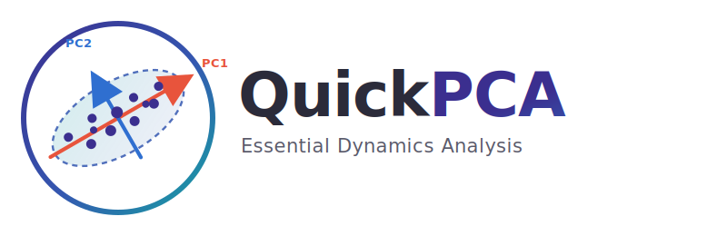
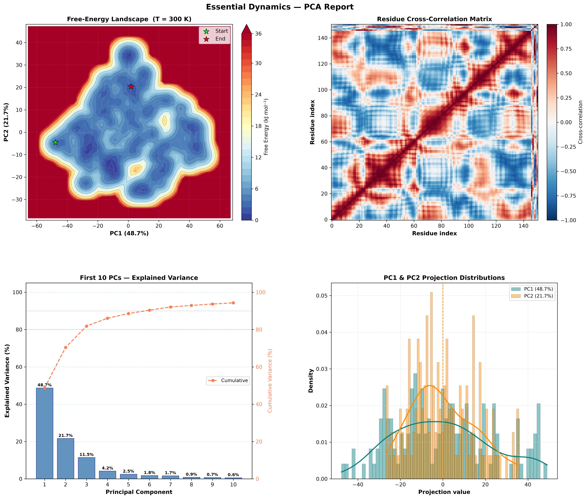

<div align="center">



# QuickPCA

### Welcome to the universe of eigenvectors — headless Essential Dynamics for MD trajectories.

[](https://pypi.org/project/quickpca/)
[](https://github.com/5x5x5x5/quickpca/actions/workflows/ci.yml)
[](https://5x5x5x5.github.io/quickpca/)
[](LICENSE)
[](https://pypi.org/project/quickpca/)
[](https://github.com/astral-sh/ruff)

</div>

---

**QuickPCA** turns long molecular-dynamics trajectories into a single, publication-ready
Essential Dynamics report. It loads your trajectory, performs Principal Component Analysis,
and renders a four-panel figure with the **free-energy landscape**, the **residue
cross-correlation map**, the **explained-variance profile**, and the **PC1/PC2 projection
distributions** — from one command, with no GUI required.

It began life as a drag-and-drop PyMOL script and is now a modern, headless, pip-installable
Python package with pluggable NumPy and JAX compute backends.

## Why PCA for MD?

Molecular dynamics trajectories carry a massive amount of data. If your protein has 1,000
atoms, each frame has 3,000 coordinates (X, Y, Z). With 10,000 frames that is 30 million
data points. PCA analyzes this dataset and reduces its dimensionality: it figures out which
atomic movements are just random "noise" and which are the "signals" capturing
functionally relevant motions. The algorithm compresses thousands of dimensions down to just
a few (PC1, PC2, ...) while preserving the most important information.

Unlike common PCA approaches, which construct and diagonalize the covariance matrix, QuickPCA
performs an **SVD decomposition** directly on the `(n_frames × 3N)` data matrix. This avoids
the costly step of diagonalizing the covariance matrix, making the approach faster and more
numerically stable, while producing identical principal components. The residue
cross-correlation matrix is subsequently recovered analytically from the PCA eigenvectors and
eigenvalues, without revisiting the raw trajectory data.

## Features

- **Headless and pip-installable** — runs on a laptop, a cluster node, or in CI; no GUI, no display required.
- **Pluggable compute backends** — a pure **NumPy** backend out of the box, plus an optional **JAX** backend for GPU/TPU acceleration.
- **Robust trajectory loading** — an [MDAnalysis](https://www.mdanalysis.org/)-based loader supporting `.nc`, `.xtc`, `.trr`, `.dcd` and `.pdb` formats.
- **Free-Energy Landscape** — Boltzmann-inverted 2-D FEL over PC1/PC2 with Gaussian smoothing.
- **Residue cross-correlation** — recovered analytically from the PCA eigenbasis.
- **Publication-ready reports** — a 2×2 matplotlib figure rendered to PNG at 300 dpi.
- **Extensible subcommand suite** — RMSF, clustering, convergence and interactive report subcommands plug in via an auto-discovered command registry.
- **PyMOL plugin** — the original drag-and-drop workflow is preserved for interactive use.

## Installation

```bash
pip install quickpca
```

> QuickPCA targets Python 3.10+ and is installable from PyPI once published.

Optional extras let you pull in only what you need:

```bash
pip install "quickpca[jax]"   # GPU/TPU acceleration via JAX
pip install "quickpca[viz]"   # interactive Plotly figures
pip install "quickpca[web]"   # Streamlit web front-end
pip install "quickpca[all]"   # everything above
```

For development:

```bash
pip install -e ".[dev]"       # pytest, ruff, mypy, pre-commit
```

## Quickstart

### Command line

Run the full load → PCA → FEL → report pipeline in one shot:

```bash
quickpca run data/reference.pdb data/trajectory.nc --interval 5
```

This writes `PCA_Report.png` to the current directory. Useful options:

```bash
quickpca run data/reference.pdb data/trajectory.nc \
    --selection "name CA" \   # MDAnalysis atom selection
    --interval 5 \            # frame stride
    --ncomp 10 \              # principal components to keep
    --temp 300 \              # temperature (K) for the FEL
    --backend numpy \         # compute backend (numpy | jax)
    --output report.png       # output PNG path
```

List the compute backends available in your environment:

```bash
quickpca backends
```

### Python API

```python
from quickpca import compute_pca_from_files, compute_fel, plot_report

# Load a trajectory and run the full PCA pipeline.
pca = compute_pca_from_files(
    "data/reference.pdb",
    "data/trajectory.nc",
    selection="name CA",
    interval=5,
    n_components=10,
    backend="numpy",
)

# Boltzmann-inverted free-energy landscape over PC1/PC2.
fel = compute_fel(pca.projections, temperature=300.0)

# Render the four-panel report to a PNG.
path = plot_report(pca, fel, output="PCA_Report.png")
print(f"Report saved to {path}")

# Inspect the decomposition.
print(f"Backend: {pca.backend}")
print(f"PC1 explains {pca.explained_variance_ratio[0] * 100:.1f}% of variance")
```

## JAX / GPU acceleration

QuickPCA's compute is isolated behind a small backend interface. The pure-NumPy backend is
always available; installing the JAX extra registers a drop-in `jax` backend that runs the
alignment and SVD on a GPU or TPU when one is present.

```bash
pip install "quickpca[jax]"
quickpca run data/reference.pdb data/trajectory.nc --backend jax
```

```python
from quickpca import available_backends, compute_pca_from_files

print(available_backends())                       # e.g. ['jax', 'numpy']
pca = compute_pca_from_files(
    "data/reference.pdb", "data/trajectory.nc", backend="jax",
)
```

Both backends produce identical principal components; the JAX path simply accelerates the
heavy linear algebra on accelerators.

## Subcommand suite

Beyond `run`, QuickPCA ships a registry of focused subcommands that are auto-discovered at
startup. Run `quickpca --help` to see everything available in your install.

| Subcommand | Description |
| --- | --- |
| `run` | Full pipeline: load → PCA → FEL → 2×2 report PNG. |
| `backends` | List the registered compute backends. |
| `rmsf` | Per-residue root-mean-square fluctuation profile. |
| `cluster` | Conformational clustering in PC space. |
| `convergence` | Sampling-convergence diagnostics over the trajectory. |
| `interactive` | Interactive (HTML/Plotly) report for exploration. |

> Some subcommands require optional extras (for example `quickpca[viz]` for interactive
> reports). Subcommands that are not installed simply do not appear in `--help`.

## PyMOL plugin

The classic drag-and-drop workflow still works for interactive sessions:

1. Place `quickPCA.py` in the same directory as your PDB and trajectory files.
2. Open your structure in PyMOL.
3. Drag and drop `quickPCA.py` into the PyMOL window.

Supported trajectory formats: `.xtc`, `.trr`, `.dcd`, `.nc`.

## Example report

QuickPCA produces a single 300-dpi figure with four panels:

- **Top-left** — Free-Energy Landscape (PC1 vs PC2)
- **Top-right** — Residue cross-correlation matrix
- **Bottom-left** — Explained-variance bar chart (with cumulative overlay)
- **Bottom-right** — PC1 & PC2 projection distributions

<div align="center">



</div>

## Documentation

Full documentation — API reference, backend guide and subcommand details — is published with
MkDocs at **<https://5x5x5x5.github.io/quickpca/>**.

## Citation

If QuickPCA contributes to results presented in a publication, thesis, report, or any other
form of scholarly or professional work, please cite it. Citation metadata is provided in
[`CITATION.cff`](CITATION.cff); GitHub renders a ready-to-use citation from the
**"Cite this repository"** button on the repository sidebar.

## License

Released under the [MIT License](LICENSE).

## Author

QuickPCA was developed by **Gleb Novikov** — [The Visual Hub](https://github.com/TheVisualHub).
